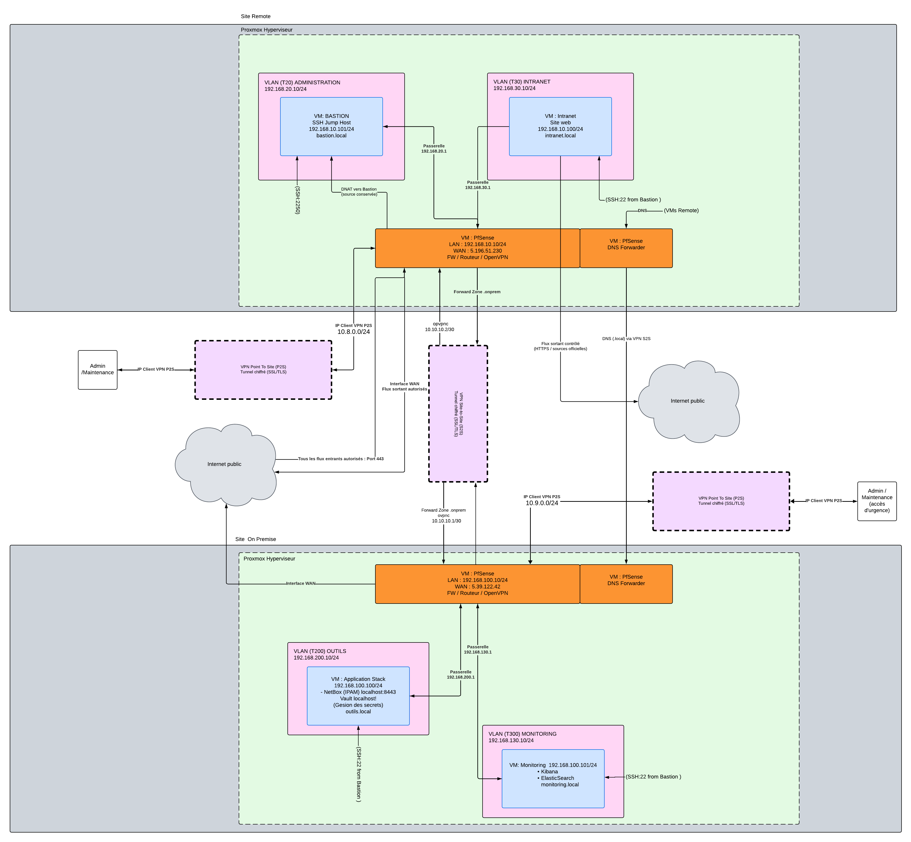

# Architecture réseau détaillé

## Description et rôle des réseaux

## Plan d’adressage IP

## Objectifs du plan d’adressage

Le plan d’adressage a pour objectif de structurer les réseaux de l’infrastructure de manière claire et cohérente, tout en garantissant la séparation des rôles, la sécurité des flux et l’évolutivité de l’architecture.

Chaque sous-réseau est associé à une fonction précise afin de limiter les interactions non nécessaires entre les différents composants de l’infrastructure.

---

## Plage d’adressage globale

L’infrastructure repose sur une plage d’adresses privées `192.168.0.0/20`, offrant une capacité suffisante pour le découpage en sous-réseaux distincts tout en conservant une marge d’évolution.

Cette plage permet un découpage homogène en sous-réseaux de type `/24`, facilitant la lisibilité, l’administration et l’exploitation de l’architecture réseau.

---

# Plan d’adressage — Site distant (Remote / Cloud)

Le site distant représente l’environnement Cloud hébergeant les services applicatifs ainsi que les composants exposés.

L’infrastructure est segmentée en plusieurs VLAN afin de séparer les usages et de renforcer la sécurité des communications réseau.

| VLAN | Nom du réseau | Sous-réseau | Description |
|---|---|---|---|
| 20 | INTRANET | 192.168.20.0/24 | Réseau destiné aux services accessibles aux utilisateurs |
| 30 | BASTION | 192.168.30.0/24 | Réseau d’administration hébergeant le bastion SSH utilisé comme point de rebond sécurisé |

Cette segmentation permet d’isoler les flux utilisateurs, les accès d’administration et les services internes conformément aux principes de sécurité réseau.

---

# Plan d’adressage - Site on-premise

Le site on-premise représente le datacenter interne de l’entreprise. Il constitue le point central d’administration et de supervision de l’infrastructure.

| VLAN | Nom du réseau | Sous-réseau | Description |
|---|---|---|---|
| 130 | MONITORING | 192.168.130.0/24 | Réseau dédié à la supervision et à la centralisation des logs |
| 200 | OUTILS | 192.168.200.0/24 | Réseau hébergeant les outils sensibles d’administration et d’automatisation |

Le réseau `MONITORING` héberge notamment les services Elasticsearch et Kibana utilisés pour l’analyse et la visualisation des événements.

Le réseau `OUTILS` héberge notamment :
- NetBox pour la gestion IPAM ;
- Vault pour la gestion sécurisée des secrets.

---

# Réseau d’interconnexion VPN

| Réseau | Sous-réseau | Description |
|---|---|---|
| VPN Site-to-Site | 10.10.10.0/30 | Réseau d’interconnexion sécurisé entre le site on-premise et le site distant |

L’utilisation d’une plage dédiée permet :
- d’éviter les conflits d’adressage ;
- de simplifier le routage ;
- et de faciliter le filtrage des flux réseau.

---

# Inventaire des machines principales

| Machine | Rôle | Adresse IP |
|---|---|---|
| Bastion | Point de rebond SSH | 192.168.20.10 |
| Intranet | Services utilisateurs | 192.168.30.10 |
| Monitoring | Centralisation des logs | 192.168.130.10 |
| Outils | Visualisation des logs | 192.168.200.10 |

## Principes de conception

Le plan d'adressage respecte les principes suivants :

-   Un réseau = un rôle fonctionnel

-   Séparation stricte entre administration, utilisateurs et services

-   Utilisation de plages privées non routables sur Internet

-   Découpage homogène en /24 pour simplifier l'exploitation et la
    maintenance

-   Possibilité d'évolution sans remise en cause de l'architecture
    existante

## Évolutivité et extensibilité de l'architecture

L'architecture réseau a été conçue avec un objectif d'évolutivité afin
de permettre l'ajout futur de nouveaux composants d'infrastructure sans
remise en cause du plan d'adressage existant.

Le découpage global en plage /20 permet de réserver plusieurs
sous-réseaux supplémentaires non encore attribués, destinés à accueillir
de futurs segments (nouveaux services, zones de sécurité, ou nœuds
d'infrastructure supplémentaires).

Dans cette optique, la conception intègre la possibilité d'ajout d'un
troisième nœud d'infrastructure ou d'un nœud d'arbitrage (witness /
quorum) pour le cluster de virtualisation. Les réseaux d'administration
et d'interconnexion ont été dimensionnés pour supporter ces extensions
sans modification des sous-réseaux actuels.

Cette approche garantit :

-   l'ajout de nouveaux nœuds sans conflit d'adressage

-   la continuité du modèle de segmentation par rôle

-   la compatibilité avec une architecture multi-sites étendue

-   la scalabilité horizontale de l'infrastructure

## Schéma réseau détaillé (LLD)

