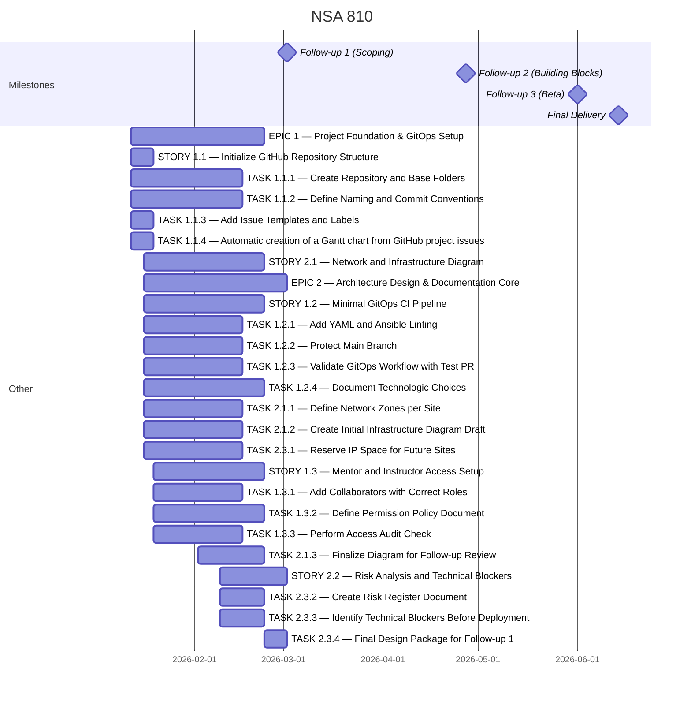

```mermaid
%%{init: {'gantt': {'leftPadding': 150}}}%%
gantt
  title NSA 810
  dateFormat YYYY-MM-DD

  section Milestones
  Follow-up 1 (Scoping) : milestone, m50, 2026-03-02, 0d
  Follow-up 2 (Building Blocks) : milestone, m756, 2026-04-27, 0d
  Follow-up 3 (Beta) : milestone, m550, 2026-06-01, 0d
  Final Delivery : milestone, m969, 2026-06-14, 0d

  section Other
  EPIC 1 — Project Foundation & GitOps Setup : 2026-01-12, 2026-02-23
  STORY 1.1 — Initialize GitHub Repository Structure : 2026-01-12, 2026-01-19
  TASK 1.1.1 — Create Repository and Base Folders : 2026-01-12, 2026-02-16
  TASK 1.1.2 — Define Naming and Commit Conventions : 2026-01-12, 2026-02-16
  TASK 1.1.3 — Add Issue Templates and Labels : 2026-01-12, 2026-01-19
  TASK 1.1.4 — Automatic creation of a Gantt chart from GitHub project issues : 2026-01-12, 2026-01-19
  STORY 2.1 — Network and Infrastructure Diagram : 2026-01-16, 2026-02-23
  EPIC 2 — Architecture Design & Documentation Core : 2026-01-16, 2026-03-02
  STORY 1.2 — Minimal GitOps CI Pipeline : 2026-01-16, 2026-02-23
  TASK 1.2.1 — Add YAML and Ansible Linting : 2026-01-16, 2026-02-16
  TASK 1.2.2 — Protect Main Branch : 2026-01-16, 2026-02-16
  TASK 1.2.3 — Validate GitOps Workflow with Test PR : 2026-01-16, 2026-02-16
  TASK 1.2.4 — Document Technologic Choices : 2026-01-16, 2026-02-23
  TASK 2.1.1 — Define Network Zones per Site : 2026-01-16, 2026-02-16
  TASK 2.1.2 — Create Initial Infrastructure Diagram Draft : 2026-01-16, 2026-02-16
  TASK 2.3.1 — Reserve IP Space for Future Sites : 2026-01-16, 2026-02-16
  STORY 1.3 — Mentor and Instructor Access Setup : 2026-01-19, 2026-02-23
  TASK 1.3.1 — Add Collaborators with Correct Roles : 2026-01-19, 2026-02-16
  TASK 1.3.2 — Define Permission Policy Document : 2026-01-19, 2026-02-23
  TASK 1.3.3 — Perform Access Audit Check : 2026-01-19, 2026-02-16
  TASK 2.1.3 — Finalize Diagram for Follow-up Review : 2026-02-02, 2026-02-23
  STORY 2.2 — Risk Analysis and Technical Blockers : 2026-02-09, 2026-03-02
  TASK 2.3.2 — Create Risk Register Document : 2026-02-09, 2026-02-23
  TASK 2.3.3 — Identify Technical Blockers Before Deployment : 2026-02-09, 2026-02-23
  TASK 2.3.4 — Final Design Package for Follow-up 1 : 2026-02-23, 2026-03-02

```