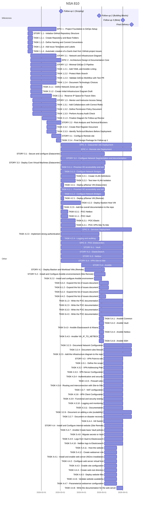

```mermaid

%%{init: {'gantt': {'leftPadding': 150}}}%%

gantt

  title NSA 810

  dateFormat YYYY-MM-DD


  section Milestones

  Follow-up 1 (Scoping) : milestone, m183, 2026-03-02, 0d

  Follow-up 2 (Building Blocks) : milestone, m990, 2026-04-27, 0d

  Follow-up 3 (Beta) : milestone, m5, 2026-06-01, 0d

  Final Delivery : milestone, m490, 2026-06-14, 0d


  section Other

  EPIC 1 - Project Foundation & GitOps Setup : 2026-01-12, 2026-02-23

  STORY 1.1 - Initialize GitHub Repository Structure : 2026-01-12, 2026-01-19

  TASK 1.1.1 - Create Repository and Base Folders : 2026-01-12, 2026-01-19

  TASK 1.1.2 - Define Naming and Commit Conventions : 2026-01-12, 2026-01-19

  TASK 1.1.3 - Add Issue Templates and Labels : 2026-01-12, 2026-01-19

  TASK 1.1.4 - Automatic creation of a Gantt chart from GitHub project issues : 2026-01-12, 2026-01-19

  STORY 2.1 - Network and Infrastructure Diagram : 2026-01-16, 2026-02-23

  EPIC 2 - Architecture Design & Documentation Core : 2026-01-16, 2026-03-02

  STORY 1.2 - Minimal GitOps CI Pipeline : 2026-01-16, 2026-02-23

  TASK 1.2.1 - Add YAML and Ansible Linting : 2026-01-16, 2026-02-23

  TASK 1.2.2 - Protect Main Branch : 2026-01-16, 2026-02-23

  TASK 1.2.3 - Validate GitOps Workflow with Test PR : 2026-01-16, 2026-02-23

  TASK 1.2.4 - Document Technologic Choices : 2026-01-16, 2026-02-23

  TASK 2.1.1 - Define Network Zones per Site : 2026-01-16, 2026-02-02

  TASK 2.1.2 - Create Initial Infrastructure Diagram Draft : 2026-01-16, 2026-02-02

  TASK 2.3.1 - Reserve IP Space for Future Sites : 2026-01-16, 2026-02-16

  STORY 1.3 - Mentor and Instructor Access Setup : 2026-01-19, 2026-02-23

  TASK 1.3.1 - Add Collaborators with Correct Roles : 2026-01-19, 2026-02-23

  TASK 1.3.2 - Define Permission Policy Document : 2026-01-19, 2026-02-23

  TASK 1.3.3 - Perform Access Audit Check : 2026-01-19, 2026-02-23

  TASK 2.1.3 - Finalize Diagram for Follow-up Review : 2026-02-02, 2026-02-23

  STORY 2.2 - Risk Analysis and Technical Blockers : 2026-02-09, 2026-03-02

  TASK 2.3.2 - Create Risk Register Document : 2026-02-09, 2026-02-23

  TASK 2.3.3 - Identify Technical Blockers Before Deployment : 2026-02-09, 2026-02-23

  STORY 4.1 - Configure Remote site : 2026-02-16, 2026-03-02

  TASK 2.3.4 - Final Design Package for Follow-up 1 : 2026-02-23, 2026-03-02

  EPIC 3 - Datacenter site Deployment : 2026-03-02, 2026-06-14

  EPIC 4 - Remote site Deployment : 2026-03-02, 2026-06-14

  STORY 3.1 - Secure and configure (Datacenter) : 2026-03-02, 2026-05-05

  STORY 3.2 - Configure Network Segmentation and documentation : 2026-03-02, 2026-06-14

  STORY 3.3 - Deploy Core Virtual Machines (Datacenter) : 2026-03-02, 2026-05-06

  TASK 3.1.1 - Proxmox VE accessibility and ssh : 2026-03-02, 2026-05-05

  TASK 3.1.2 - Configure Network Bridges : 2026-03-02, 2026-05-05

  TASK 3.2.1 - Create VLAN Definitions : 2026-03-02, 2026-03-23

  TASK 3.2.2 - Test Inter-VLAN Isolation : 2026-03-02, 2026-03-23

  TASK 3.3.1 - Deploy pfSense VM (Datacenter) : 2026-03-02, 2026-03-06

  TASK 4.1.1 - Proxmox VE accessibility and ssh : 2026-03-02, 2026-05-05

  TASK 4.1.2 - Configure Network Bridges : 2026-03-02, 2026-05-05

  TASK 4.2.1 - Deploy pfSense VM (Remote) : 2026-03-02, 2026-03-06

  TASK 4.2.2 - Deploy Bastion Host VM : 2026-03-02, 2026-03-31

  TASK 2.2.5 - Add the overall documentation to the repo : 2026-03-02, 2026-03-05

  TASK 6.3.1 - POC-Netbox : 2026-03-02, 2026-03-12

  TASK 6.1.1 - POC-Vault : 2026-03-02, 2026-03-12

  TASK 6.2.1 - POC-Elastic : 2026-03-02, 2026-03-23

  TASK 6.4.1 - POC-VPN-Site-To-Site : 2026-03-02, 2026-03-23

  EPIC 5 - Services Deployment : 2026-03-02, 2026-06-14

  TASK 4.2.3 - Implement strong authentication : 2026-03-02, 2026-04-27

  TASK 4.2.4 - Logging and auditing : 2026-03-02, 2026-04-27

  EPIC 6 - POC (Datacenter) : 2026-03-02, 2026-06-01

  STORY 6.1 - Vault : 2026-03-02, 2026-06-01

  STORY 6.2 - ElasticSearch : 2026-03-02, 2026-06-01

  STORY 6.3 - Netbox : 2026-03-02, 2026-06-01

  STORY 6.4 - VPN Site-to-Site : 2026-03-02, 2026-06-01

  STORY 5.4 - Ansible : 2026-04-01, 2026-06-01

  STORY 4.2 - Deploy Bastion and Workload VMs (Remote) : 2026-04-06, 2026-05-05

  STORY 5.2 - Install and Configure Ansible environmement (Site Remote) : 2026-04-20, 2026-05-06

  TASK 5.2.2 - Install and configure Ansible environment : 2026-04-20, 2026-05-01

  TASK 6.3.2 - Expand the list of issues document : 2026-04-27, 2026-05-11

  TASK 6.1.2 - Expand the list of issues document : 2026-04-27, 2026-05-11

  TASK 6.2.2 - Expand the list of issues document : 2026-04-27, 2026-06-01

  TASK 6.4.2 - Expand the list of issues document : 2026-04-27, 2026-05-07

  TASK 6.1.3  - Write the POC documentation : 2026-04-27, 2026-06-01

  TASK 6.2.3  - Write the POC documentation : 2026-04-27, 2026-06-01

  TASK 6.3.3  - Write the POC documentation : 2026-04-27, 2026-06-01

  TASK 6.4.3  - Write the POC documentation : 2026-04-27, 2026-06-01

  TASK 5.4.1 - Ansible Common : 2026-04-27, 2026-05-04

  TASK 5.4.2 - Ansible Vault : 2026-04-27, 2026-05-04

  TASK 5.4.3 - Ansible Elasticsearch & Kibana : 2026-04-27, 2026-05-04

  TASK 5.4.4 - Ansible Netbox : 2026-04-27, 2026-05-04

  TASK 5.4.5 - Ansible VM_IP_TO_NETBOX : 2026-04-27, 2026-05-04

  TASK 5.4.6 - Ansible SSH : 2026-04-27, 2026-05-04

  TASK 3.2.3 - Document Network Configuration : 2026-05-04, 2026-06-14

  TASK 3.2.4 - Document rules firewall : 2026-05-04, 2026-06-14

  TASK 3.2.5 - Add the infrastructure diagram to the repo : 2026-05-04, 2026-06-14

  STORY 4.3 - VPN Point-to-site : 2026-05-04, 2026-06-01

  TASK 4.3.1 - Define the scope : 2026-05-04, 2026-06-01

  TASK 4.3.2 - VPN Addressing Plan : 2026-05-04, 2026-06-01

  TASK 4.3.3 - VPN Server Configuration : 2026-05-04, 2026-06-01

  TASK 4.3.4 - Authentication and security : 2026-05-04, 2026-06-01

  TASK 4.3.5 - Firewall rules : 2026-05-04, 2026-06-01

  TASK 4.3.6 - Routing and interconnection with Site-to-Site : 2026-05-04, 2026-06-01

  TASK 4.3.7 - NAT configuration : 2026-05-04, 2026-06-01

  TASK 4.3.8 - VPN Client Configuration : 2026-05-04, 2026-06-01

  TASK 4.3.9 - Functional and security testing : 2026-05-04, 2026-06-01

  TASK 4.3.10 - Logging and monitoring : 2026-05-04, 2026-06-01

  TASK 4.3.11 - Documentation : 2026-05-04, 2026-06-01

  TASK 3.2.6 - Document on adding a site (scalability) : 2026-05-04, 2026-06-14

  TASK 3.2.7 - Document on disaster recovery : 2026-05-04, 2026-06-14

  TASK 6.4.4 - Kill Switch : 2026-05-04, 2026-06-01

  STORY 4.4 - Install and Configure internal website (Site Remote) : 2026-05-05, 2026-06-01

  TASK 5.4.7 - Ansible  Create basic Vault policies : 2026-05-05, 2026-06-01

  TASK 5.4.8 - Migrate secrets to Vault : 2026-05-05, 2026-06-01

  TASK 5.4.9 - Logs from Vault to Elasticsearch : 2026-05-05, 2026-06-01

  TASK 5.4.10 - NetBox logs to Elasticsearch : 2026-05-05, 2026-06-01

  TASK 5.4.11 - Host the website : 2026-05-05, 2026-05-23

  TASK 5.4.12 - Create webserver role : 2026-05-05, 2026-05-23

  TASK 4.4.1 - Install and enable web server (NGinx installation) : 2026-05-05, 2026-05-23

  TASK 4.4.2 - Configure web server virtual host : 2026-05-05, 2026-05-23

  TASK 4.4.3 - Enable site configuration : 2026-05-05, 2026-05-23

  TASK 4.4.4 - Create web root directory : 2026-05-05, 2026-05-23

  TASK 4.4.5 - Deploy website files : 2026-05-05, 2026-05-23

  TASK 4.4.6 - Validate website availability : 2026-05-05, 2026-05-23

  TASK 4.4.7 - Parameterize webserver configuration : 2026-05-05, 2026-05-23

  TASK 4.4.8 - Write the documentation for the web server : 2026-05-23, 2026-06-01


```

